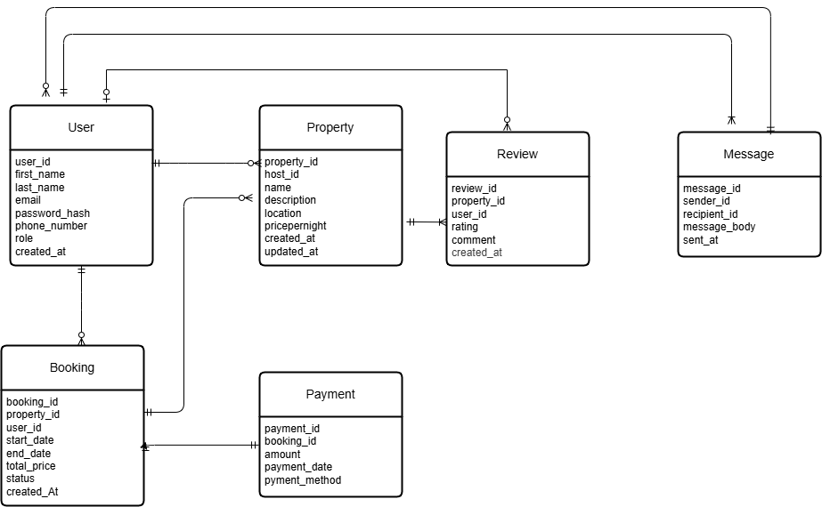

# ERD Requirements and Design

## ERD Diagram

## Entity-Relationship Diagram (ERD) Components

The database consists of six core entities (tables):
- User
- Property
- Booking
- Payment
- Review
- Message

## Detailed Relationships and Explanations

### 1. User and Property: One-to-Many (1:N)
- **Relationship**: A User can be a Host and list multiple properties, but each Property is managed by only
  one host.
- **Cardinality**: 1 User : N Properties (One-to-Many)
- **Reason**: The Property table has a `host_id` Foreign Key that references the `user_id` Primary Key in
  the User table. This correctly models that a single person (the host) is responsible for a listing, while
  one person can be the host of many listings. The role ENUM in the User table allows for easy querying
  of host users.

### 2. User and Booking: One-to-Many (1:N)
- **Relationship**: A User (the guest) can make multiple Bookings, but each Booking is made by only one
  user.
- **Cardinality**: 1 User : N Bookings (One-to-Many)
- **Reason**: The Booking table includes a `user_id` Foreign Key that references the `user_id` in the
  User table, linking a booking instance to the specific user who made it.

### 3. Property and Booking: One-to-Many (1:N)
- **Relationship**: A Property can have many Bookings over time, but each specific Booking is for only
  one property.
- **Cardinality**: 1 Property : N Bookings (One-to-Many)
- **Reason**: The Booking table includes a `property_id` Foreign Key that references the `property_id`
  in the Property table, establishing which property is being reserved.

### 4. Booking and Payment: One-to-One (1:1)
- **Relationship**: Each Booking will have exactly one associated Payment transaction to record the
  financial details.
- **Cardinality**: 1 Booking : 1 Payment (One-to-One)
- **Reason**: The Payment table includes a `booking_id` Foreign Key referencing the `booking_id` Primary Key of
  the Booking table. This structure suggests a completed booking results in a single, final payment
  record.

### 5. User and Review: One-to-Many (1:N)
- **Relationship**: A User can write many Reviews, but a specific Review is written by only one user.
- **Cardinality**: 1 User : N Reviews (One-to-Many)
- **Reason**: The Review table has a `user_id` Foreign Key, linking the review to the user who submitted
  it. This allows tracking a user's reviewing history.

### 6. Property and Review: One-to-Many (1:N)
- **Relationship**: A Property can receive many Reviews from different guests, but a specific Review is
  only for one property.
- **Cardinality**: 1 Property : N Reviews (One-to-Many)
- **Reason**: The Review table has a `property_id` Foreign Key, linking the review and rating to the
  specific property being evaluated.

### 7. User and Message (Sender): One-to-Many (1:N)
- **Relationship**: A User can send multiple Messages, but each Message has a single sender.
- **Cardinality**: 1 User : N Messages (One-to-Many)
- **Reason**: The Message table has a `sender_id` Foreign Key referencing the `user_id` in the User
  table, identifying the message originator.

### 8. User and Message (Recipient): One-to-Many (1:N)
- **Relationship**: A User can receive multiple Messages, but each Message has a single recipient.
- **Cardinality**: 1 User : N Messages (One-to-Many)
- **Reason**: The Message table has a `recipient_id` Foreign Key also referencing the `user_id` in the
  User table, identifying the intended message recipient.

## Key Design Notes

1. **User Roles**: The User table includes a role ENUM to distinguish between regular users and hosts.
2. **Message System**: The Message entity maintains two relationships with User (as sender and
  recipient) through different foreign keys.
3. **Review System**: Reviews are linked to both the property being reviewed and the user writing the review.
4. **Payment Tracking**: Each booking has an associated payment record for financial tracking.

---

## Normalization follow-up (summary)

This document originally summarized the high-level ERD. After normalization the schema was expanded and
refined to improve data integrity and support application features. Key deltas from the original
requirements:

- Core entities expanded from 6 to 10 to support normalization and practical features:
	- Added `location` (extracted address components) to remove transitive dependencies and support geo
	  queries.
	- Added `amenity` and `property_amenity` junction table to normalize amenities and support
	  many-to-many relationships.
	- Added `property_availability` to model per-date availability and dynamic pricing.
	- Augmented `payment` to support multiple payments per booking and refunds.
- Fields that were composite (like `full_name`, `location`) were split into atomic columns
  (`first_name`, `last_name`, address components) to satisfy 1NF.
- Additional audit and soft-delete fields (`created_at`, `updated_at`, `deleted_at`) were added to
  most entities for maintainability and safer deletions.

For the full normalized design and rationale see `../normalization.md`.